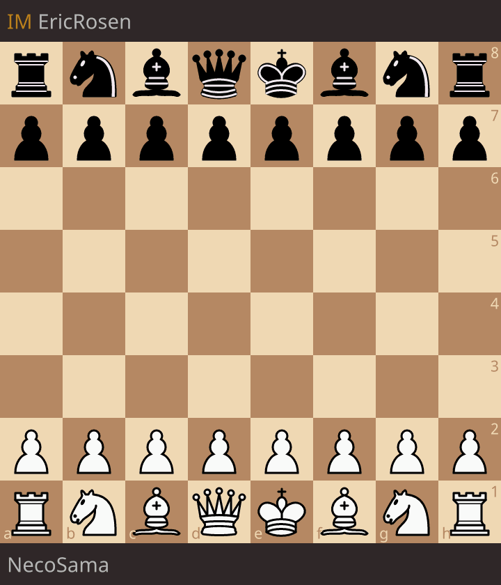

## Juggling

I love juggling! I taught myself how to juggle during my master's years. I try to teach my colleagues and friends whenever I get the chance. My favorite juggling pattern is the **531** siteswap. 

[//]: "https://github.com/user-attachments/assets/6893821e-8f5e-42e5-9f73-ac5dba4219b5" 

<video width="320" height="580" controls loop="" muted = "" autoplay="" >
    <source src="../files/juggling.MOV">
</video>
[Alex Sweeten](https://genomeinformatics.github.io/people/sweeten/) helped me film the video at Decker Quad on the Homewood campus.

## Chess
I become a big chess fan after watching _The Queen's Gambit_, and now I play regularly at [Charmcity chess club](https://charmcitychess.com/).

  
  

I had the honor of playing against International Master [Eric Rosen](https://en.wikipedia.org/wiki/Eric_Rosen_(chess_player)) on one of his livestreams. Eric's commentary on the game can be viewed [here](https://www.youtube.com/live/qhEUW57jIDw?si=zY_1ZCbwWM_UIiYr&t=1983).

## BTBA Podcast (Moments in Biotech)
Since season 3, I've been editing and hosting several episodes of the [BTBA Podcast](https://www.btbatw.org/podcast/), a Mandarin-language podcast that interviews Taiwanese professionals working in biotech. I am co-producing the podcast with [Crystal Peng](https://sciprofiles.com/profile/ypeng) in Season 6.

