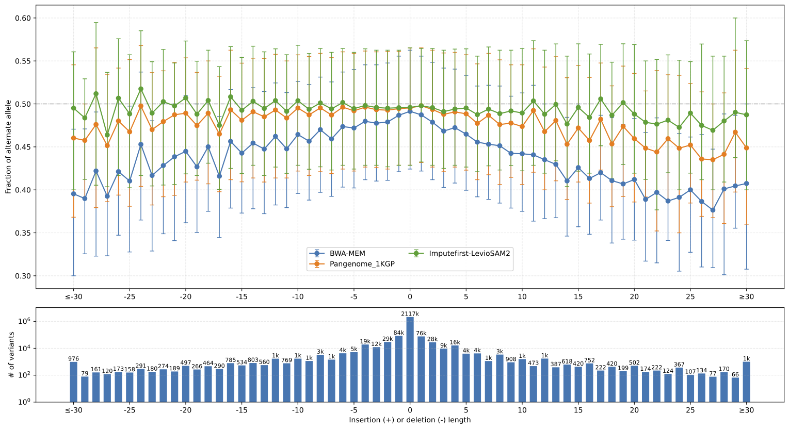
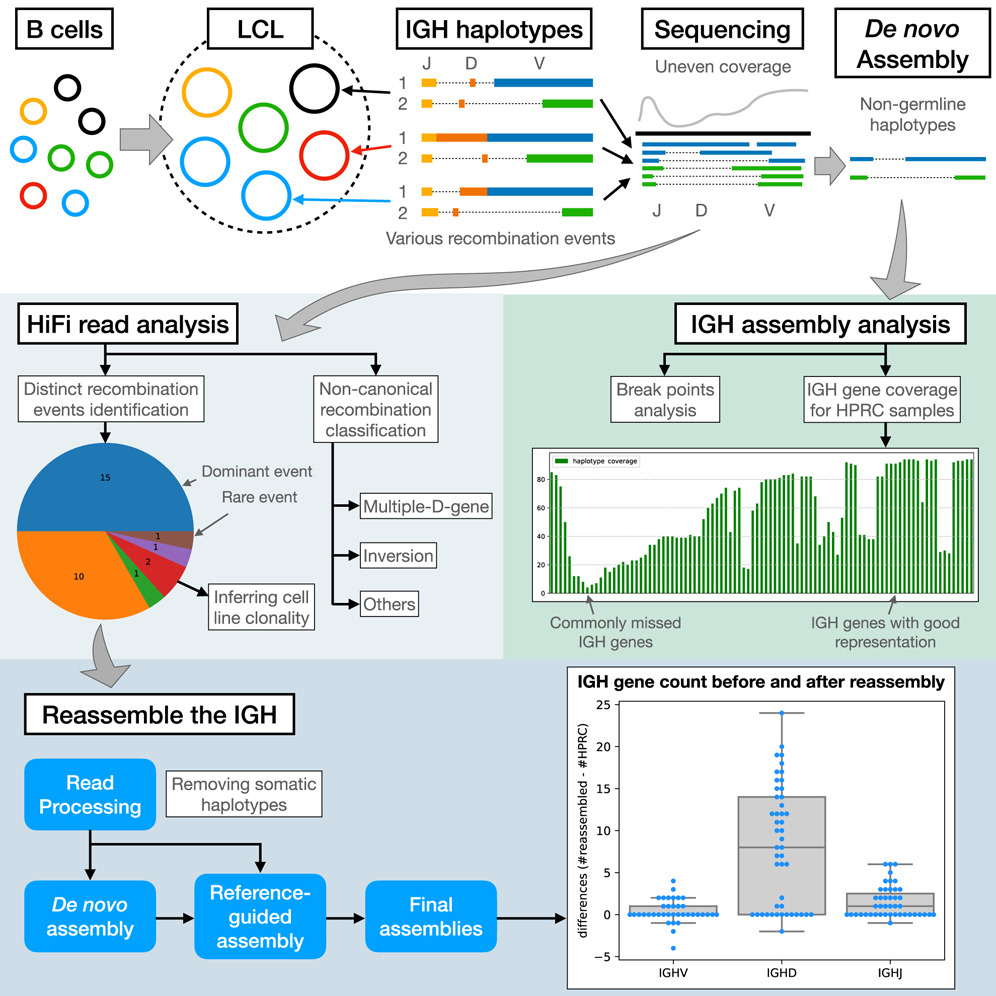

You can also find my articles on [my Google Scholar profile](https://scholar.google.com/citations?user=L_EVYB8AAAAJ&hl=en).

## Reference bias analysis

Reference bias in sequence alignment is the case where reads with non-reference alleles fail to align correctly.  As a result, the alignment is skewed toward the genotype of reference genome, which can affect the accuracy of downstream analysis.

Many alignment methods are developed to reduce reference bias. However, there is a lack of methods for analyzing reference bias. Hence, we developed **biastools**, a framework to measure, categorize, and visualize reference bias.

- [biastools paper](https://genomebiology.biomedcentral.com/articles/10.1186/s13059-024-03240-8) is published in Genome Biology (2024).
- [biastools software](https://github.com/maojanlin/biastools) is available on GitHub.

I also participated in the impute-first project. In which we used imputation to create a personalized reference genome before to sequence alignment, hence reduce reference bias, and achieve high variant calling accuracy in downstream analysis. I developed the workflow using [LevioSAM2](https://github.com/milkschen/leviosam2) to lift the alignment from personalized genome to a standard genome such as GRCh38 or T2T-CHM13. This workflow is an alternative to graph aligner when using impute-first framework. All the steps are in linear space and easy to operate.

- [impute-first paper](https://genome.cshlp.org/content/early/2026/03/05/gr.280989.125)
- [impute-first software](https://github.com/kvaddad1/impute-first) is available on GitHub.

An example bias-by-allele-length plot from **biastools** with linear genome alignment, VG alignment with 1KGP graph genome, and impute-first workflow with LevioSAM2.

    
        
Bias-by-allele-length plot of HG002
        

## Profiling of adaptive immune receptor repertoire (AIRR)

Adaptive immune receptor repertoire (AIRR) is encoded by T cell receptor (TR) and immunoglobulin (IG) genes. Profiling these germline genes encoding AIRR (abbreviated as gAIRR) is important in understanding adaptive immune responses but is challenging due to the high genetic complexity. We developed **gAIRR-suite** to profile human TR and IG genes through public available personal phased assemblies and capture-based targeted sequencing genomic DNA.

- [gAIRR-suite paper](https://www.frontiersin.org/journals/immunology/articles/10.3389/fimmu.2022.922513/full) is published in Frontiers in Immunology (2022).
- [gAIRR-suite software](https://github.com/maojanlin/gAIRRsuite) is available on GitHub.

High-quality human genome assemblies derived from lymphoblastoid cell lines (LCLs) provide reference genomes and pangenomes for genomics studies. However, LCLs pose technical challenges for profiling immunoglobulin (IG) genes, as their IG loci contain a mixture of germline and somatically recombined haplotypes, making genotyping and assembly difficult with widely used frameworks. We developed **IGLoo** to analyzed the V(D)J recombination events in a LCL-based sequence data. We further reassemble the HPRC IG heavy chain (IGH) locus based on the recombination information. The reassembled IGH locus contains more IG genes and lower overall switching error rate comparing to original HPRC-v1 assemblies.

- [IGLoo paper](https://doi.org/10.1016/j.crmeth.2025.101033) is published in Cell Reports Methods (2025)
- [IGLoo software](https://github.com/maojanlin/IGLoo) is available on GitHub.

    
        
IGLoo profiles the IGH locus from LCL dataset
        

